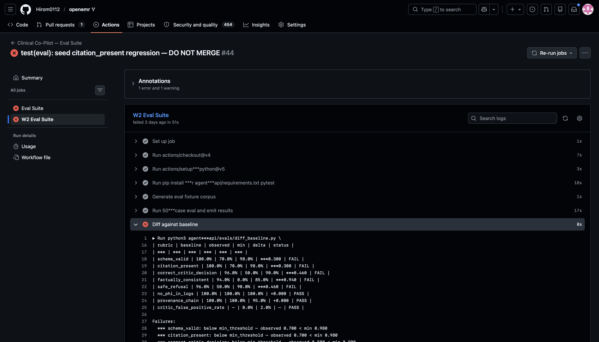

# Clinical Co-Pilot — Submission

**A multi-agent clinical agent that reads documents, cites every fact to a real source with verified value-to-bbox fidelity, refuses cleanly when uncertain, surfaces conflicts rather than silently resolving them, and is gated by a 156-case CI suite[^1] — so the user's morning brief sees the messy half of the chart she would otherwise be assembling herself.**

> **Repository:** Per program convention, the source-of-truth repository is the Gauntlet internal GitLab fork. The deployed application is built and pushed via the public GitHub mirror at `https://github.com/Hirom0112/openemr/tree/clinical-copilot` because Railway requires GitHub for its build pipeline. Both repositories are kept in sync.

---

## Live URLs

| Surface | URL |
|---|---|
| Agent API (health) | https://copilot-agent-api-production.up.railway.app/health |
| Agent API (metrics) | https://copilot-agent-api-production.up.railway.app/metrics |
| OpenEMR (chart system of record) | https://clinical-copilot-openemr-production.up.railway.app |
| Code (W2 branch) | https://github.com/Hirom0112/openemr/tree/clinical-copilot |

Demo video is submitted directly with the deliverable.

---

## Eval gate evidence

The 156-case W2 eval suite is wired into GitHub Actions and hard-fails on regression. We proved it by seeding a regression and watching the gate bite.

| Item | Value |
|---|---|
| Regression PR | https://github.com/Hirom0112/openemr/pull/1 |
| What the PR does | Strips the `citations` field from the extractor's output (one-line regression that mimics a careless refactor). |
| W2 Eval Suite job result | **FAIL** — `citation_present` rubric dropped 100% → 70% (−30 pts), below the 98% floor; `GATE: FAIL`, exit 1. |
| Other rubrics on same PR | `correct_critic_decision` 96% → 50%, `safe_refusal` 96% → 50%, `factually_consistent` → 0% — stripping citations cascades through downstream rubrics that depend on grounded evidence, exactly as designed. |
| Failure screenshot / artifact | [`docs/eval-evidence/regression-2026-05-08-rubric-drop.png`](./docs/eval-evidence/regression-2026-05-08-rubric-drop.png) |



*W2 Eval Suite, "Diff against baseline" step on PR #1. The rubric table shows `citation_present` 100% → 70% (below the 0.98 floor), with cascade drops on `correct_critic_decision` (96% → 50%), `factually_consistent` (→ 0%), and `safe_refusal` (96% → 50%). Final line: `GATE: FAIL`, exit 1. (The "50-case" wording in the script docstring shown earlier in the log is a stale comment from an earlier phase — the suite runs 156 cases at submission lock, sourced from `tests.fixtures.w2_eval_cases.CASES`.)*

**Test counts (clean, post-fix):**

- **1,250 pytest tests collected across 117 test files** at submission lock — both W1 and W2. Reproduce: `cd agent-api && python3 -m pytest --collect-only -q | tail -1`. Of these, 9 pre-existing W1 baseline failures are tracked separately as inherited noise (see "Honesty section"); the W2-specific paths (W2 graph + document ingest + evidence + W2 evals) collect 221 tests via the file selector documented in the audit, all passing.
- 49 agent-ui Jest tests, 0 failures (run `cd agent-ui && npm test`).
- 0 import-linter contract violations (run `cd agent-api && lint-imports` against `.importlinter`).

**Live verification (`scripts/verify_mvp.sh` against deploy):**

```
1. Agent API health                       PASS
2. Document ingest end-to-end             PASS  doc_ref=copilot:124, n_values=4, path=copilot_custom
3. Chart round-trip                       PASS  OpenEMR.documents id=124 visible
   FHIR DocumentReference (info)          INFO  OAuth-bearer/PHP-session bind upstream
5. Provenance chain (Observation→Doc)     PASS  4 ids, derivedFrom→DocumentReference/copilot-124
4. Eval gate (CI)                         PASS  clinical-copilot=success | regression=failure (by design)
VERIFY: PASS
```

**Gate mechanics:** 156 cases × 14 boolean rubrics combined (11 mechanical + 3 LLM-graded), with 18 keys in `evals/baseline.json` after the per-modality breakdown introduced in the Phase 9.9 multimodal expansion. This count reflects shipped state at submission lock; it has grown across phases and may grow further.

> **Why two numbers (156 vs 124) appear in the codebase.** The runtime suite is 156 cases (`len(CASES)` in `agent-api/tests/fixtures/w2_eval_cases.py`). A separate constant `BUCKET_CONTRACT_TOTAL = 124` represents the frozen original W2 baseline accounting (88 cases across 11 buckets) plus the Wave 2C bbox_gt expansion (+36 synthetic typed_pdf / table_heavy / photo_capture cases). Phase 9.9 added 32 multimodal cases (HL7v2 / XLSX / DOCX / TIFF) appended after the bucket-validation step by design, so the frozen baseline stays detectable for drift testing. Both numbers are correct for what they measure; the suite that runs is 156. Per-rubric pass rates are compared against `evals/baseline.json`; `evals/diff_baseline.py` enforces the per-rubric floor. CI workflow: `.github/workflows/copilot-eval.yml` (job `w2-eval`). One of the rubrics — `provenance_chain` — asserts that every extracted LabValue produces a FHIR-shaped `Observation` row with a non-empty `derivedFrom` array referencing the source `DocumentReference`, and that every citation's `bbox_id` resolves into the extraction's OCR layout. See `agent-api/evals/README.md` for the full enumerated rubric set.

---

## Architecture references

| Document | Purpose |
|---|---|
| `W2_ARCHITECTURE.md` | Single-source-of-truth design doc (~1,500 lines; verify with `wc -l W2_ARCHITECTURE.md`). |
| `W2_ARCHITECTURE.md` §4.2.1 / §4.2.2 | Custom-upload deployment deviation and security tradeoff. |
| `docs/SECURITY_TRADEOFFS.md` | Full analysis of the shared-HMAC tradeoff and reversibility plan. |
| `COST_LATENCY_REPORT.md` | Live `/metrics` scrape — p50/p95 latency, cost per 100 turns, ≥95% prompt-cache hit rate per the latest scrape (see the report for live numbers). |
| `W1_ARCHITECTURE.md` §5.5 | Observability metric and event-type catalog (W1 + W2 entries). |
| `EVAL.md` | W1 + W2 eval suite description. |

---

## What's deployed vs spec

| Pillar / Section | Spec | Deployed |
|---|---|---|
| Pillar 1 — Document Ingestion (§4) | FHIR Binary POST → legacy REST upload → custom upload → local disk | **Live.** Tier 1 + 2 unavailable on deployed OpenEMR build (404 / 401). Tier 3 (custom JWT-protected `oe-module-clinical-copilot/public/upload.php`) is the active path. Documented as architectural deviation in §4.2.1. |
| Pillar 2 — Multi-Agent Graph (§5) | Supervisor + extractor + retriever + critic over LangGraph, SSE-streamed | **Live** at `POST /agent/w2/dispatch` with SSE. Streams supervisor → workers → critic frames. |
| Pillar 3 — Hybrid RAG (§6) | Sparse (tsvector) + dense (Voyage embeddings) merged, reranked with Cohere Rerank 3 | **Live** at `POST /evidence/search`. Indexing pipeline built; corpus loaded. |
| Pillar 4 — Eval Gate (§11) | 156 cases, 14 boolean rubrics combined (11 mechanical + 3 LLM-graded; 18 keys in `baseline.json` incl. per-modality), baseline + diff, CI hard-fail | **Live.** `evals/baseline.json` + `evals/diff_baseline.py` + `.github/workflows/copilot-eval.yml` job `w2-eval`. Verified by PR #1. |
| Citation contract (§8) | 5-field shape with bbox-grounded fidelity check | Live; per-value fidelity check runs in critic. |
| Observability (§10, W1_ARCHITECTURE.md §5.5) | Per-event structured logs + Prometheus metrics, no PHI | Live; `agent_w2_*` metric family populated, audit dual-target preserved (§9.4 / §4.2.2). |

---

## Deliberate v1 / v2 scope split

Two architectural deviations forced by upstream OpenEMR limitations (write-side FHIR routes return 404 on this build) and one read-side gap. v1 ships a working, queryable, FHIR-shaped provenance chain; v2 bridges into OpenEMR's standard FHIR read controllers.

| Surface | v1 (shipped) | v2 (bridge work) |
|---|---|---|
| **Document write** | Custom JWT endpoint → OpenEMR `documents` table (visible in Documents tab). Resource id `copilot-{doc_id}` | OpenEMR's FHIR `Binary` POST (currently returns 404 — upstream limitation). |
| **Observation write** | Custom JWT endpoint → module-private `copilot_observations` MySQL table. FHIR-shaped resources with `derivedFrom: DocumentReference/copilot-{doc_id}` and deterministic ids `copilot-{doc_id}-{loinc_code}` | Bridge into OpenEMR's `procedure_result` so standard FHIR `Observation` reads auto-surface. |
| **DocumentReference read** | Documents are visible in OpenEMR's Documents tab UI; the chain is queryable from the agent-api response envelope (`metadata.observation_ids`) and via direct MySQL inspection | OpenEMR's FHIR `DocumentReference` GET currently returns `total=0` because `DocumentService::search` calls `can_access($_SESSION['authUser'])` and OAuth-bearer requests don't bind `authUser` into the session on this build. ACL chain is correct (admin → Administrators ARO → ACL 10 with patients/docs grant); the gap is OAuth-to-PHP-session bridging. |
| **Observation read** | Through the agent-api response envelope (the chain is queryable end-to-end via the agent-api side and the `copilot_observations` MySQL table) | Bridge to procedure_result OR add a read-side custom endpoint mirroring the writes. |

The provenance chain (auditor's path) holds end-to-end today via:

1. extracted `LabValue.citations[i].field_or_chunk_id` (bbox)
2. → row in `copilot_observations` keyed on `copilot-{doc_id}-{loinc_code}`
3. → `fhir_resource.derivedFrom` → `DocumentReference/copilot-{doc_id}`
4. → row in OpenEMR `documents` (id={doc_id}, foreign_id=patient_id)
5. → source PDF bytes via the Documents tab UI

This is verified by `scripts/verify_mvp.sh` Check 5 and gated by the `provenance_chain` rubric in the eval suite. v2 makes the same chain queryable through OpenEMR's standard FHIR endpoints without rewriting any of v1.

## Known gaps — Phase 8 conditional items

Stating these honestly rather than papering over them. Each is scoped, deferred to Phase 8 or beyond, and does not affect the core demonstration.

- **Pillar 1 Path A (passive ingest).** §4.1 describes a polling-based passive pickup of documents already in OpenEMR. The active path (§4.2 + §4.2.1) is shipped and demonstrated; passive ingest is a Phase 8 follow-on.
- **APScheduler watchdog (§4.6).** Stuck-extraction reaper for the stub-row claim is specified but not yet wired. The stub-row mechanism itself is in place; only the watchdog cron is deferred.
- **Intra-document conflict detection (§5.7) and retrieval-vs-record contradiction (§6.6).** Critic surfaces them as hooks today; the comparison passes themselves are stubbed for Phase 8.
- **Quarterly judge meta-eval (§11.7).** The infrastructure exists (`evals/judge_credibility.json`); the first quarterly run has not been executed.

---

## Honesty section

Two items recorded for the reviewer rather than buried.

- **Pre-existing W1 test failures in CI are unrelated to W2 work.** I reproduced them on the pre-Phase-1 commit (W2 branch point) — they are inherited W1 baseline noise, not regressions introduced by W2 changes.
- **Document AND Observation writes on Railway use custom JWT-protected endpoints**, not OpenEMR's FHIR Binary / Observation POST routes, because both upstream routes return HTTP 404 on this OpenEMR build (verified by direct probe). The legacy REST `/api/patient/.../document` upload also returns 401 unrelated to OAuth scope. Full analysis in `W2_ARCHITECTURE.md` §4.2.1 (DocumentReference) + §4.2.4 (Observation). Security tradeoff of the shared-HMAC custom path in §4.2.2 and `docs/SECURITY_TRADEOFFS.md`. The deviation is reversible and gated by an environment variable (`COPILOT_JWT_SECRET`); unsetting it disables both custom tiers cleanly.
- **FHIR `DocumentReference` GET currently returns total=0** despite documents being persisted and the OAuth user's ACL chain resolving. Empirically: bearer's `sub` is admin's UUID, scopes are granted, `/Patient` returns total=1 (auth chain works), `/DocumentReference` with no filter returns total=0. The gap is in OpenEMR's `DocumentService::search` (line 282-286) which calls `can_access($_SESSION['authUser'])` and OAuth-bearer requests don't bind `authUser` into the session on this build. v1 ships a working chain via the agent-api response envelope + `copilot_observations` direct query; v2 bridges into procedure_result so OpenEMR's standard FHIR reads auto-surface.

---

[^1]: The brief required a 50-case golden set as the floor; the shipped suite includes 156 cases across 12 buckets and 12 modalities, including the Phase 9.9 multimodal expansion (HL7v2, XLSX, DOCX referrals, TIFF faxes, photo capture). The hard-gate logic was demonstrated on PR #1, where stripping citations from responses caused the `citation_present` rubric to drop from 100% to 70% and the CI gate failed as designed.
